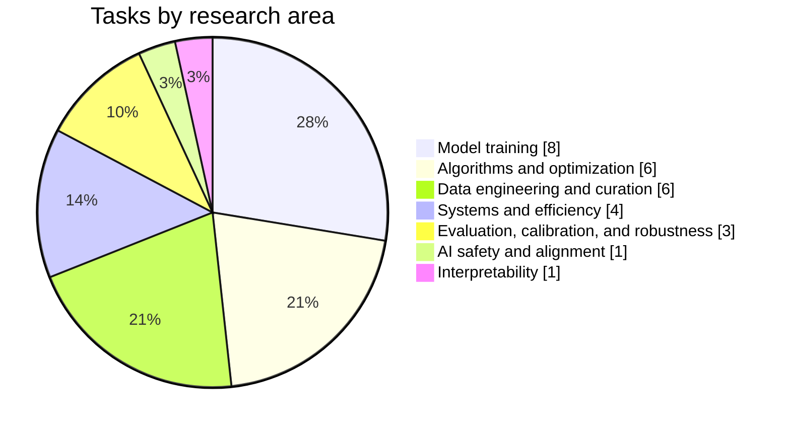

# AutoResearchExam

This repository contains the 29 tasks from [AutoResearchExam](https://benchmarks.bespokelabs.ai/autoresearchexam/).

## Task areas

View tasks by area →

### Model training

#### Representation learning

- [Compact encoding for a column with many categories](./hicard-latent-encoder)
- [Compact item embeddings for recommendations](./sparse-elsa-item-embeddings-8nnz)
- [Short binary codes for image search](./mlh-coco-16bit-hash-head-map5000)

#### Reinforcement learning

- [Advantage estimation for policy training](./grpo-rl-halfcheetah-advantage-estimator)
- [Reliable control policy trainer](./reppo-reliable-onpolicy-control-trainer)

#### Predictive modeling

- [Predict valid actions for a game policy](./vas-maskless-deployment-feasibility)
- [Rank employee access requests from ID codes](./dctabeval-aeac-pooled-cat-statistics)

#### Model merging and distillation

- [Eight domain vision model merging](./ties-merging-clip-vitl14-eight-task-merge)

### Algorithms and optimization

#### Statistical methods

- [Estimate uncertainty in a streaming optimizer](./sketched-newton-cov-estimator)
- [Estimate individual treatment effects](./causalpfn-cate-pehe-ihdp-surfaceb)
- [Recover river flow links](./causalrivers-heldout-station-graph-auroc)

#### Constrained optimization

- [Dual market budgeted classification](./budgeted-covtype-dual-market-open)
- [MILP branching policy](./tgat-milp-branching-node-count)
- [Online chance constrained policy](./sopcc-online-chance-constrained-policy)

### Data engineering and curation

#### Imputation

- [Budgeted imputation](./budgeted-imputation-mcar50)
- [Sparse panel imputation](./act-tensor-sparse-panel-imputation-r2)

#### Data selection

- [Unlabeled pool pruning](./activeprune-al-unlabeled-pool-pruning)
- [Low discrepancy subset selection](./carps-star-discrepancy-subset-select)
- [Group robust coreset selection](./coreset-selection-group-robust-waterbirds)
- [Pretraining token budget selection](./less-is-more-pretrain-token-budget-selector)

### Systems and efficiency

#### Inference

- [CPU language model decoding](./cpu-llm-decode-throughput)
- [CPU decoder graph execution](./cpu-decoder-graph-executor)
- [Video diffusion transformer caching](./fastercache-budgeted-video-dit-cache-policy)

#### Compression

- [SVDQuant PixArt Sigma quantization](./svdquant-w4a4-psnr)

### Evaluation, calibration, and robustness

#### Metric estimation

- [Shortest valid confidence interval](./shortest-valid-ci-l2-ece)
- [Label efficient risk estimation](./label-efficient-risk-estimator)

#### Robustness

- [Adversarially robust CIFAR 10 training](./fast-adv-budgeted-pgd50-robust-cifar10)

### AI safety and alignment

- [Candidate token loss ranker](./fastergcg-candidate-token-rank-ccc)

### Interpretability

- [Sparse dictionary coding](./sae-sparse-dict-nmse-frontier)

