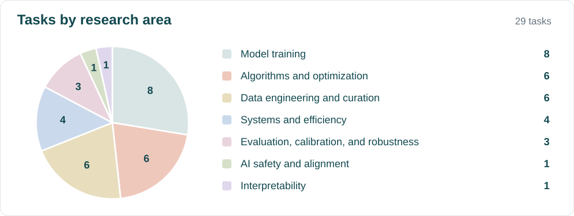

# AutoResearchExam

This repository contains the 29 tasks from [AutoResearchExam](https://benchmarks.bespokelabs.ai/autoresearchexam/).

[Run with the official harness](#run-with-the-official-harness) or
[use your own harness](#use-your-own-harness).

## Task areas

[](https://benchmarks.bespokelabs.ai/autoresearchexam/#tasks)

Click the chart to explore tasks by research area.

<details>
<summary>View tasks by area →</summary>

### Model training

#### Representation learning

- [Compact encoding for a column with many categories](./hicard-latent-encoder)
- [Compact item embeddings for recommendations](./sparse-elsa-item-embeddings-8nnz)
- [Short binary codes for image search](./mlh-coco-16bit-hash-head-map5000)

#### Reinforcement learning

- [Advantage estimation for policy training](./grpo-rl-halfcheetah-advantage-estimator)
- [Reliable control policy trainer](./reppo-reliable-onpolicy-control-trainer)

#### Predictive modeling

- [Predict valid actions for a game policy](./vas-maskless-deployment-feasibility)
- [Rank employee access requests from ID codes](./dctabeval-aeac-pooled-cat-statistics)

#### Model merging and distillation

- [Eight domain vision model merging](./ties-merging-clip-vitl14-eight-task-merge)

### Algorithms and optimization

#### Statistical methods

- [Estimate uncertainty in a streaming optimizer](./sketched-newton-cov-estimator)
- [Estimate individual treatment effects](./causalpfn-cate-pehe-ihdp-surfaceb)
- [Recover river flow links](./causalrivers-heldout-station-graph-auroc)

#### Constrained optimization

- [Dual market budgeted classification](./budgeted-covtype-dual-market-open)
- [MILP branching policy](./tgat-milp-branching-node-count)
- [Online chance constrained policy](./sopcc-online-chance-constrained-policy)

### Data engineering and curation

#### Imputation

- [Budgeted imputation](./budgeted-imputation-mcar50)
- [Sparse panel imputation](./act-tensor-sparse-panel-imputation-r2)

#### Data selection

- [Unlabeled pool pruning](./activeprune-al-unlabeled-pool-pruning)
- [Low discrepancy subset selection](./carps-star-discrepancy-subset-select)
- [Group robust coreset selection](./coreset-selection-group-robust-waterbirds)
- [Pretraining token budget selection](./less-is-more-pretrain-token-budget-selector)

### Systems and efficiency

#### Inference

- [CPU language model decoding](./cpu-llm-decode-throughput)
- [CPU decoder graph execution](./cpu-decoder-graph-executor)
- [Video diffusion transformer caching](./fastercache-budgeted-video-dit-cache-policy)

#### Compression

- [SVDQuant PixArt Sigma quantization](./svdquant-w4a4-psnr)

### Evaluation, calibration, and robustness

#### Metric estimation

- [Shortest valid confidence interval](./shortest-valid-ci-l2-ece)
- [Label efficient risk estimation](./label-efficient-risk-estimator)

#### Robustness

- [Adversarially robust CIFAR 10 training](./fast-adv-budgeted-pgd50-robust-cifar10)

### AI safety and alignment

- [Candidate token loss ranker](./fastergcg-candidate-token-rank-ccc)

### Interpretability

- [Sparse dictionary coding](./sae-sparse-dict-nmse-frontier)

</details>

## Run with the official harness

[AutoResearchExam-Terminus](https://github.com/bespokelabsai/AutoResearchExam-Terminus)
is the official harness for timed runs with repeated experiments and public
validation feedback.

Install [uv](https://docs.astral.sh/uv/), start Docker, and configure your model
provider's credentials (`OPENAI_API_KEY` for the OpenAI example below).
Download the tasks and harness into separate folders:

```bash
mkdir autoresearch-exam-run && cd autoresearch-exam-run
git clone https://github.com/bespokelabsai/AutoResearchExam.git github-tasks
git clone https://github.com/bespokelabsai/AutoResearchExam-Terminus.git harness
cd harness
uv sync --python 3.12 --extra modal
```

Run one task with the default 24-hour research budget on local Docker.
`harbor run` starts the full research and grading loop automatically:

```bash
uv run harbor run \
  --path ../github-tasks/cpu-decoder-graph-executor \
  --agent autoresearchexam-terminus \
  --model openai/gpt-5.6-sol \
  --env docker \
  --plugin autoresearch-exam \
  --pk max_iterations=5000 \
  --pk max_duration_seconds=86400
```

Use `--path ../github-tasks` to run all tasks. The defaults allow up to 5000
experiments and 50000 model turns within the 24-hour budget.

For Modal, use a shorter run, such as 22 hours for this CPU example, to leave
room before its [24-hour sandbox timeout](https://modal.com/docs/guide/sandboxes#timeouts).

Find saved runs in [Results](https://github.com/bespokelabsai/AutoResearchExam-Terminus#results),
then [compute AUARC](https://github.com/bespokelabsai/AutoResearchExam-Terminus#compute-auarc).

## Use your own harness

You can run the same tasks with Claude Code, Codex, or another agent harness.
Keep the task environment, graders, and time budget the same. Select each
checkpoint by public validation and measure its private test score on the same
saved artifact. Report test performance, but never use test scores to select
checkpoints. Keep private test data, scores, and logs outside the agent
environment throughout the run and checkpoint selection.

Follow the [custom harness guide](https://github.com/bespokelabsai/AutoResearchExam-Terminus/blob/main/scripts/custom_harness.md)
to record timestamped scores and compute AUARC with the existing script.

## Citation

If you use AutoResearchExam in your research, please cite:

```bibtex
@misc{ramesh2026autoresearchexam,
  author = {Ramesh, Anirudha and
            Devic, Siddartha and
            Garg, Shivank and
            Parulekar, Advait and
            Mahnot, Drish and
            Pimpalgaonkar, Shreyas and
            Suresh, Vishnu and
            Dimakis, Alex and
            Sathiamoorthy, Maheswaran},
  title = {{AutoResearchExam}},
  year = {2026},
  month = sep,
  url = {https://benchmarks.bespokelabs.ai/autoresearchexam/},
  note = {Published September 9, 2026}
}
```
